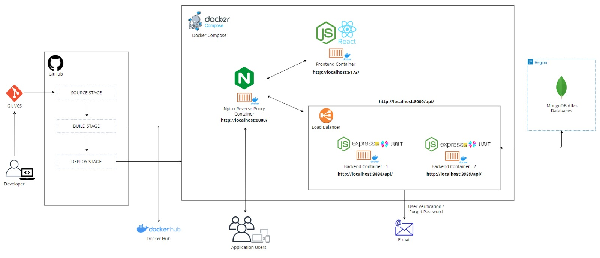

# Web-based Secure Health Data Sharing Platform Among Medical Professionals and Researchers 

## Table of Contents
1. [Introduction](#introduction)
2. [System Architecture](#system-architecture)
3. [Development Setup](#development-setup)
    - [Installing Node.js and npm](#installing-nodejs-and-npm)
    - [Backend Setup](#backend-setup)
    - [Frontend Setup](#frontend-setup)
4. [Running the Application](#running-the-application)
    - [Docker & Docker Compose Setup](#docker--docker-compose-setup)
    - [Nginx Reverse Proxy](#nginx-reverse-proxy)
    - [Running Up Application](#running-the-application)
    - [Running Up Application](#stop-services)
7. [Contributing](#contributing)
8. [License](#license)

## Introduction
Our project introduces a secure web-based platform for sharing healthcare projects and anonymized data, enabling seamless collaboration among clinicians and researchers. This innovative tool leverages advanced technologies to enhance healthcare innovation and improve patient outcomes.​

This project is a web application comprising a Node.js backend using Express.js and a React.js frontend using Tailwind CSS. The backend and frontend services are containerized using Docker, and the application is orchestrated using Docker Compose. This README will guide you through setting up the development environment and running the application on a local machine.

## System Architecture



The system architecture includes the following components:
- **Frontend Container**: Serves the React application created with Vite.
- **Backend Containers**: Instances of the Node.js Express API
- **Nginx Reverse Proxy Container**: Acts as a reverse proxy to route traffic to the frontend and backend services.
- **MongoDB Atlas**: Cloud-based database service.

## Development Setup

We wrote our project using only JavaScript language, therefore, in order to develop backend or frontend of our project, first you need to install node.js and npm to your machine.

### Installing Node.js and npm

Node.js is a JavaScript runtime built on Chrome's V8 JavaScript engine, and npm is the package manager for Node.js.

#### Windows

1. **Download the Node.js Installer**:
   Go to the [Node.js download page](https://nodejs.org/en/download/) and download the Windows installer.

2. **Run the Installer**:
   Run the downloaded `.msi` file and follow the installation instructions. Make sure to check the box that says "Automatically install the necessary tools" to install `npm` as well.

3. **Verify Installation**:
   Open a command prompt and type:
   ```sh
   node -v
   npm -v
   ```
   You should see the version numbers of Node.js and npm.

#### Linux

1. **Update your package index**:
   ```sh
   sudo apt update
   ```

2. **Install Node.js and npm**:
   ```sh
   sudo apt install nodejs npm
   ```

3. **Verify Installation**:
   ```sh
   node -v
   npm -v
   ```


### Backend Setup

1. **Navigate to the Backend Directory**:
    ```sh
    cd backend
    ```

2. **Install Dependencies**:
    ```sh
    npm update
    ```

3. **Run the Backend Server**:
    ```sh
    node app.js
    ```

### Frontend Setup

1. **Navigate to the Frontend Directory**:
    ```sh
    cd frontend
    ```

2. **Install Dependencies**:
    ```sh
    npm install
    ```

3. **Run the Frontend Server**:
    ```sh
    npm run dev
    ```


## Running the Application

### Docker & Docker Compose Setup

Ensure you have Docker and Docker Compose installed on your machine. You can download Docker from [here](https://www.docker.com/products/docker-desktop), and Docker Compose from [here](https://docs.docker.com/compose/install/).

#### Verify Installation:

**For Windows**:

    docker --version
    docker-compose --version
    

**For Linux**:
   ```sh
   sudo docker --version
   ```
   ```sh
   docker compose --version
   ```
You should see the version numbers of Docker and Docker Compose.

### Nginx Reverse Proxy

The Nginx reverse proxy configuration (default.conf file) is located in the `nginx` directory in the main project directory. This configuration routes traffic to the appropriate frontend and backend services.


### **Navigate to the Main Project Directory**:
    ```sh
    cd path/to/main_project_directory
    ```

### **Build and Run the Containers**:
    
**For Linux:**

    sudo docker compose build --no-cache
    sudo docker compose up

**For Windows:**

    docker-compose up


This command will build the Docker images and start the containers as defined in the `docker-compose.yml` file. The application will be accessible at `http://localhost:8000`.

### **Stop Services**:
**For Linux:**

    sudo docker compose down

**For Windows:**

    docker-compose down


<!-- ## Environment Variables

Ensure to set the following environment variables for both backend and frontend:

### Backend Environment Variables
- `PORT`: Port number for the backend server (e.g., 3838, 3939)
- `MONGO_URI`: MongoDB Atlas connection string
- `JWT_SECRET`: Secret key for JWT authentication
- `EMAIL_SERVICE`: Email service provider (e.g., SMTP)
- `EMAIL_USER`: Email service user
- `EMAIL_PASS`: Email service password -->

<!-- ### Frontend Environment Variables
- `REACT_APP_API_URL`: URL of the backend API (e.g., `http://localhost:8000/api`) -->

## Contributing

We welcome contributions to improve this project. Please follow the standard Git workflow:
1. Fork the repository
2. Create a feature branch
3. Commit your changes
4. Push to your fork
5. Create a pull request

## License

This project is licensed under the MIT License. See the [LICENSE](LICENSE) file for details.